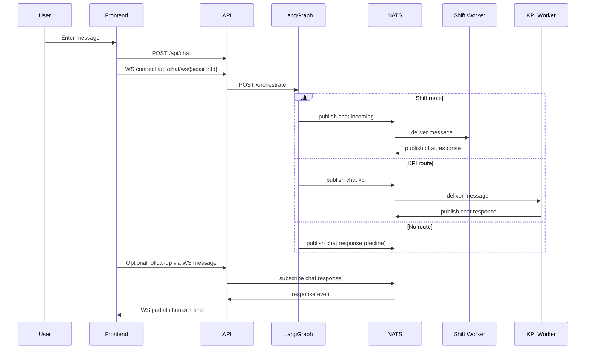

# Architecture Overview

## Purpose
This system is a local-first, containerized chat platform designed to demonstrate:
- Orchestrated routing with LangGraph-style node selection
- Event-driven worker processing through NATS JetStream
- Session-scoped streamed chat responses over WebSocket
- End-to-end distributed tracing with OpenTelemetry and Arize Phoenix

## Service Topology
```mermaid
flowchart LR
  UI[Frontend\nReact + Vite\n:3000] -->|POST /api/chat| API[API Service\nFastAPI\n:4000]
  UI -->|WS /api/chat/ws/{sessionId}| API

  API -->|POST /orchestrate| LG[LangGraph Service\nFastAPI\n:5000]

  LG -->|publish chat.incoming| NATS[(NATS JetStream\n:4222 / :8222)]
  LG -->|publish chat.kpi| NATS
  LG -->|publish chat.response decline| NATS

  NATS -->|consume chat.incoming| SW[Shift Worker]
  NATS -->|consume chat.kpi| KW[KPI Worker]

  SW -->|publish chat.response| NATS
  KW -->|publish chat.response| NATS

  KW <--> COSMOS[Cosmos Emulator\n:8081, :10250]

  API -->|OTLP| PHX[Arize Phoenix\n:6006]
  LG -->|OTLP| PHX
  SW -->|OTLP| PHX
  KW -->|OTLP| PHX
```

## Core Runtime Responsibilities

### Frontend
- Maintains a generated sessionId per browser session.
- Sends user messages to POST /api/chat.
- Opens WebSocket to /api/chat/ws/{sessionId} after first POST.
- Renders partial agent updates in place using isPartial=true events.

### API Service
- Validates inbound chat payload.
- Starts a tracing span and forwards request to LangGraph /orchestrate.
- If LangGraph request fails, falls back by publishing directly to chat.incoming.
- Keeps POST /api/chat as initial entry point.
- Maintains WebSocket session endpoint for streaming and follow-up question submission.
- Subscribes to chat.response and emits word-level streaming chunks over WebSocket.
- Filters outgoing stream events by sessionId.

### LangGraph Service
- Applies keyword-based node matching against local graph nodes.
- Routes to:
  - chat.kpi for KPI/metrics-related prompts
  - chat.incoming for shift/scheduling prompts
  - chat.response with a decline message when no node matches
- Publishes NATS messages with trace context headers.

### Shift Worker
- Durable-consumes chat.incoming (worker_pool).
- Generates randomized response text for shift-related requests.
- Publishes chat.response with responseSource=shift-worker.

### KPI Worker
- Durable-consumes chat.kpi (kpi_worker_pool).
- Queries Cosmos emulator for product/KPI documents.
- Returns formatted KPI summary with kpiHits and responseSource=kpi-worker.

### NATS JetStream
- Streams used:
  - chat_incoming (subject chat.incoming)
  - chat_kpi (subject chat.kpi)
  - chat_response (subject chat.response)
- Enables decoupled routing and independent worker scaling.

### Cosmos Emulator
- Local datastore for synthetic KPI records.
- Bootstrapped/queried by KPI worker through retry logic.

### Arize Phoenix
- Local OTLP trace receiver and UI.
- Visualizes distributed traces across API, LangGraph, and workers.

## Message Flow


## Observability Model

### Trace Context Propagation
- HTTP headers from API -> LangGraph.
- NATS headers from LangGraph/Workers -> API stream emission spans.

### Key Attributes
- chat.session_id
- chat.message_length
- chat.orchestration
- chat.orchestration.target
- orchestration.candidates
- orchestration.matched_keywords
- nats.publish.subject
- stream.word_count
- stream.first_chunk_latency_ms
- stream.total_duration_ms
- kpi.query.product
- kpi.query.hit_count

### Typical Trace Path
api.send_chat -> orchestrate.request -> worker.<domain>.process -> api.stream.emit

## Deployment Notes
- All services run via docker-compose.yml.
- Default OTLP endpoint points to local Phoenix at http://phoenix:6006/v1/traces.
- Cloud Arize can be used by overriding OTEL_EXPORTER_OTLP_ENDPOINT and OTEL_EXPORTER_OTLP_HEADERS.

## Current Architectural Constraints
- Routing logic is deterministic keyword matching (not model-based planner).
- No authentication or multi-tenant isolation layer.
- No dedicated test harness for integration traces yet.
- Compose file includes a deprecated top-level version field.
